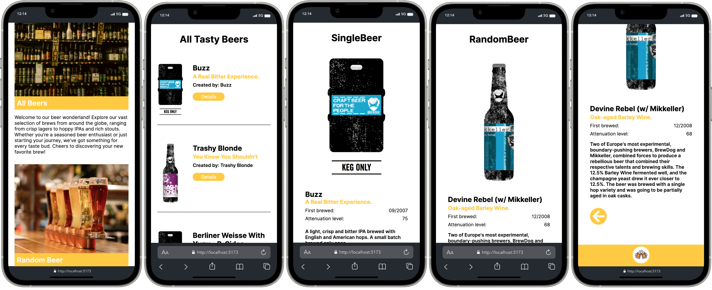

# SuperCode Beer Shop Project

## Purpose of the website

- Create a Beer Shop
- Fetch Data from Beers API
- Dynamic Routing with React Router DOM

## Built with

- Mobile Design
- Grid and Flexbox Layout
- React
- React Router DOM
- Fetch-API

## Links

- [See live site here](https://super-code-beer-api-react-rooter-dom-project.vercel.app/)
- [GitHub Repository](https://github.com/thomaserdmenger/superCode-Beer-API-React-Rooter-DOM-Project)
- [GitHub Author](https://github.com/thomaserdmenger)
- [LinkedIn Author](https://www.linkedin.com/in/thomaserdmenger/)

## Screenshot-Image

